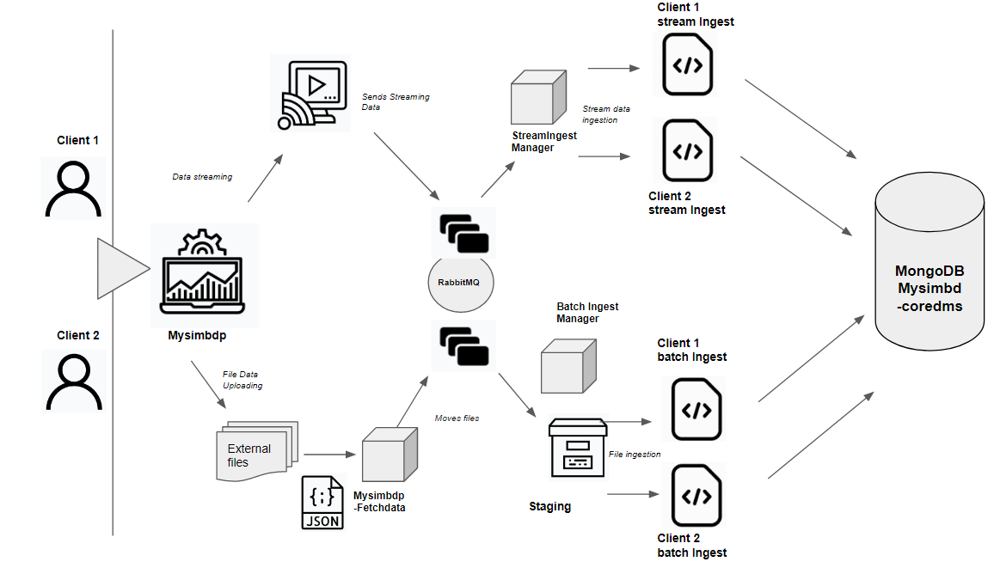
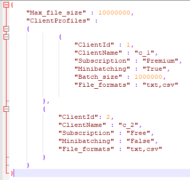

# Assigment 2: Working on data Ingestion Features
##Big Data Platforms
##Part 1: Ingestion with batch
### Project Design

In the picture above it can be seen the two pipelines or ingestion methods for this assigment, these would be the Batch Ingestion and the Stream Ingestion. Both of them will be independent and execute work indepently. Both of them will store data in our storage system MongoDB, this would be our mysimbdp-coredms.

#### Batch ingestion pipeline

This pipeline would be responsible of ingesting batches of data files into our platform, but we need to define some constraints in order to have a safety/well managed data ingestion. With this `config.json` file we can define parameters such as type of file, size and also we can define some specific client configuration which will allow as to define the type of service/monetization we are providing to our customers so in some way we define also  how our platform interacts with each user. This part of the configuration would be added for each new user that registers to use our services.

The next component would be ``mysimbdp-fetchdata``, this component would be run as a small server to constantly examinate ``client-input-directory`` to find files from users to ingest, everytime a file is detected it will compare the parameters with ``config.json`` parameters. If the file is not filtered, this means all parameters are under an allowed scope for our platform, the file would be move to a temporal storage called staging.If the file is filtered, it could be flagged as not accepted by editing the file name and adding a "non-accepted" tag or it could be moved to a another directory where the client had access, in this way we could inform the client that a determined file is not accepted and also avoiding editing and erase client data. This would be a intermediate storage area used for data processing before the ingestion. It would be here where we could implement a micro-batching feature, but we would need define this parameter by customer in ``config.json``.

After this,  ``mysimbdp-fetchdata`` will send a message to RabbitMQ for ingestion to the ``mysimbdp-batchingestmanager``

#### Batch ingest manager

This module will be listening to the RabbitMQ message broker. The message will contain an specific id for each client, and when its received, the manager will fetch ``clientingestapp`` script name for the specific client.  

#### Client ingest app

This app will be called by the batch ingest, it should be provided by each client. It will ingest the data/files of the particular client into the MongoDB. In order to achieve maximum flexibility for the ingestion type, we should allow regular data storage and object storage using gridFS buckets in mongoDB. Instead of storing a file in a single document, MongoDB-GridFS divides the file into chunks and stores each chunk as a separate document. MongoDB is useful for storing files that exceed the maximum size imposed in the BSON format but also for access data without needing to access the whole file.

##Part 2: Stream ingest
### Stream ingest design
### Understanding RabbitMQ (technology for mysimbdp-dataBroker)
In order to enable data streaming from different sources, we are using a message broker. We will use RabbitMQ which was used in the design of the first assigment for allowing multithreading of different clients and queieng requests to the ``-coredms`` module.

For this assigment we need to implement a near-realtime ingestion, RabbitMQ is a message queueing hybrid broker. It has support for different protocols AMQP, MQTT. MQTT is designed to be used on lightweight devices for its simplecity, it is wide use in IoT devices, but for my big data dreamed platform I will use AMQP protocol which could provide more advanced features.

For the data ingestion, the broker will have a queue for each client to publish data, it will always be running sending messages. ``stream-ingestmanager`` will be responsible to receive the messages in the right queue and saving the file in the database.

##Part 3: Integration and Extension
#### 1. Produce an integrated architecture for both batch and near-realtime ingestion features in this assignment and explain the architecture.

The architecture would be similar to the lambda architecture shown above, it consist on a generic, scalable and fault-tolerant data processing architecture. To produce the batch layer of the lambda architecture we will combine ``fetchData`` and ``batch-ingest-manager`` this layer will manage the input dataset and pre-compute the batch views which can then be combined with views from speed layer to provide actionable insights to customers. The views from batch layer are joined with views from speed layer in the presentation layer. In case of failure, we can recompute the views and we would have the same consistent state back. 
The ``RabbitMQ`` and ``stream-ingest-manager`` would become the real-time-layer or speed layer, which basically compensates for the high latency of updates to the serving layer and deals with recent data only. In comparison this layer contains less data, this is done by purging the data at regular intervals.

#### 2. Assume that if a file for batch ingestion is too big to ingest using the batch ingestion implementation in Part 1, design your solution to solve this problem by reusing your batch or near-realtime components in Parts 1 or 2.

We could tackle this problem on 2 ways, for both we would need to divide the oversized files in small files. One way of doing it would be to start queueing this chunks of data in the message broker which would provoke a lag in the overall ingestion time for real-time data, afterwards the``stream-ingers-manager`` would be responsible to ingest the data. The 2nd way would be through the ``batch-ingestion`` pipeline, this way the message broker will not slow down the stream-data.

#### 3. Regardless of programming languages used, explain why you as a platform provider should not see the code of the customer, like clientbatchingestapp and clientstreamingestapp. In which use cases, you can assume that you know the code?

Data privacy from clients and protection and security from our side. Client data could be sensitive so it is important to provide a trustful service. Also, to create a robust and safe platform we need to keep it away from malicious data that could damage our system.

#### 4. If you want to detect the quality of data and allow ingestion only for data with a pre-defined quality of data condition, how you, as a platform provider, and your customers can work together?
In order to maintain the quality of the data, we could create a service as part of the ``clientstreamingestapp/clientbatchingestapp`` to examinate the value of data compared to a predefined parameters that the client could set up during the registration in our big data platform. This way we could generate a jsonSchema for our MongoDB that could contain strict constrains for each type of dataset that the client generates.

#### 5. If a consumer has multiple clientbatchingestapp and clientstreamingestapp, each is suitable for a type of messages or files, how would you extend your design and implementation in Parts 1 & 2 (only explain the concept/design) to support this requirement.

We would need to augment ``batchingestmanager`` and ``streamingestmanager`` to create instances for different client apps, we could stipulate in mysimbdp instructions to add a number or code in the client app scripts and then we could map this number to identify how many of the client apps of each category our simple big data platform has to deal with. 