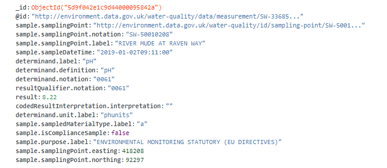

# Assigment 1: Building your Big Data Platform
##Part 1: Design
##### 1.1 Design Design and explain interactions between main components in your architecture of mysimbdp

 The main important components are the REST API. built using Python Flask and the MongoDB managed my MongoDB Atlas
##### 1.2 Explain how many nodes are needed in the deployment of mysimbdp-coredms so that this component can work property (theoretically based on the selected technology )
As im using MongoDB Atlas, the classical approach would be to have a 2nd node for increasing the availability. We will consider 3 nodes so in case the primary node falls, the 2 duplicates will be ready to keep the platform online. This makes the platform fault-tolerant, also we could buy more clusters for our platform, this clusters would manage the more nodes and therefore scaling our platform horizontally

##### 1.3 Will you use VMs or containers for mysimbdp and explain the reasons for each component

MongoDB atlas creates its own containers so we will not need to create a container and run an image of MongoDB inside it. Nevertheless I have been studying VMs vs containers and I can say that containers prove to be much more lighter and fast hence enhancing the availability of our data.VMs are isolated and would be useful if we are concerned about security.

##### 1.4. Explain how would you scale mysimbdp to allow a lot of users using mysimbdp-dataingest to push data into mysimbdp

As im using MongoDB Atlas, the cluster I use in there is allocated in Google Cloud Platform service which provides a wide variety of hardware that you can buy, CPU and memory usages that will be available on a dinamic basis if our platform requires it. We can either scale vertically by purchasing another CPU and RAM or scale horizontally by ordering resources and adding more servers containing more clusters. Horizontal scaling is far more productive than vertical for the reason that giving more CPU power or memory to a cluster will always be under the threat of being bombarded with a big number of queries.

##### 1.5 Explain your choice of industrial cloud infrastructure and/or mysimbdp-coredms provider, when you do not have enough infrastructural resources for provisioning mysimbdp

I will be using the water quality dataset of the United Kingdom. A document oriented data based like MongoDB will be a good 
choice for mysimbdp-coredms. MongoDB has 2 main advantages. First, you can shard the database creating dividing the database between many
 different servers (horizontal scaling) and high availability with replica sets, which basically is that MongoDB creates backups of the
 data and when the main DB fails, a replica becomes the prime DB. Im using MongoDB Atlas, which offers to choose between AWS, Google or Azure. Google Cloud Service got my attention because we will be able to setup machine learning and big data analytics to our data from the cloud itself.

##Part 2: Development and deployment

##### 2.1 Design and explain the data schema/structure for mysimbdp-coredms

##### 2.2 Explain how would you partition the data in mysimbdp-coredms into different shards/partitions 

MongoDB partitions the collections by keys, we as Big Data engineers can define the size of this partitions but it is important to make them even to secure availability and speed. When we split a dataset between many databases it is important to also take in consideration the geographical position of each server containing the database to avoid lagging. This method allows a database to scale horizontally along with the data and the traffic, making the big data platform adaptable to usage deltas

##### 2.3 Write a mysimbdp-dataingest that takes data from your selected sources and stores the data into mysimbdp-coredms 

##### 2.4  Given your deployment environment, show the uploading performance (response time and failure) of the tests for 1,5, 10, .., n of concurrent mysimbdp-dataingest pushing data into mysimbdp-coredms

I could not manage to perform such tests, but the response time will logically increase on a exponential tendency the more concurrent threads inject data.

##### 2.5 Observing the performance and failure problems when you push a lot of data into mysimbdp-coredms (you do not need to worry about duplicated data in mysimbdp), propose the change of your deployment to avoid such problems (or explain why you do not have any problem with your deployment)

When we overload a database the canonical method is to use a technology that could handle multiples querys at the same time. For this reason we designed to add a technology that could buffer all this requests and share them between the different shards of the database. RabbitMQ is a message broker that can be used for creating streaming apps and real-time data pipelines. 
This tecnology can process streams in real time or store them for future use and it can be scalable horizontally.

## Part 3: Extension with discovery

##### 3.1  Assume that each of your tenants/users will need a dedicated mysimbdp-coredms. Design the data schema of service information for mysimbdp-coredms that can be published into an existing registry (like ZooKeeper, consul or etcd) so that you can find information about which mysimbdp-coredms for which tenants/users

ZooKeeper provides a centralized service for information configuration management, synchronization and pack services. Assuming we wil have multiple coredms, one for each user, we will save the user_id and the mongodb transaction information. The service will be distributed and the user will be matched with the right database.

##### 3.2 
 
##### 3.3 Explain how you would change the implementation of mysimbdp-dataingest (in Part 2) to integrate a service discovery feature (no implementation is required)
We will need to connect first to the Zookeeper, obtain the information related with the service and procced to connect to the DB 
##### 3.4
  
##### 3.5  